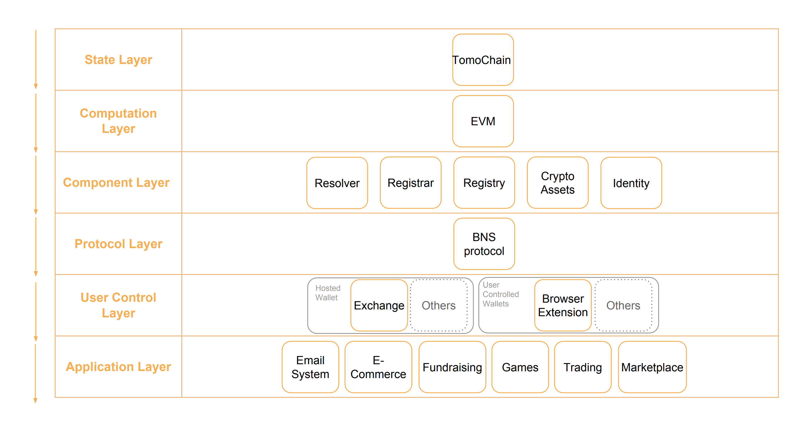
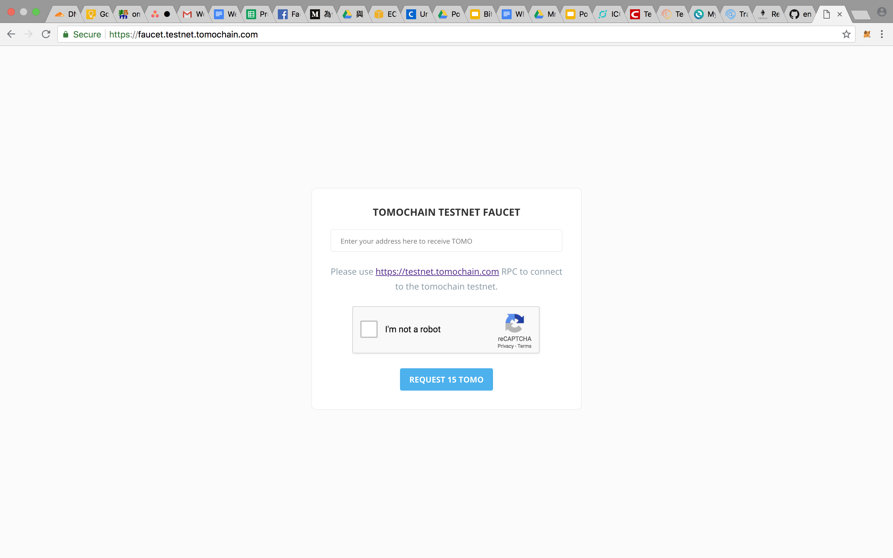
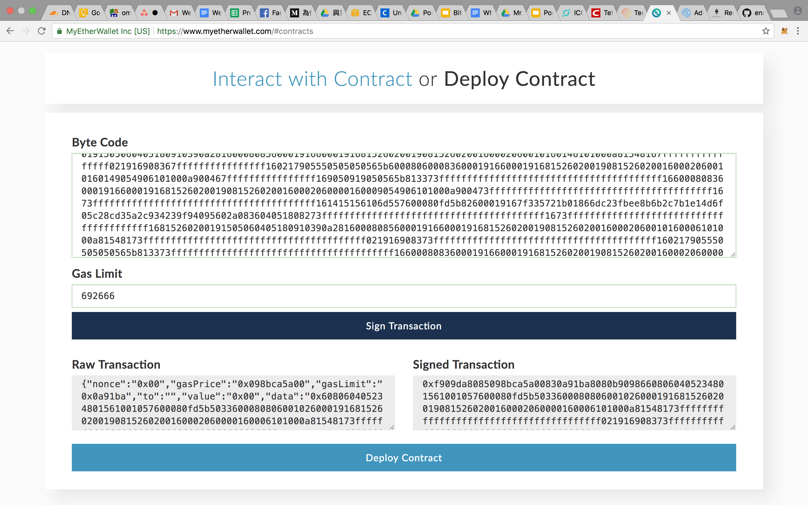
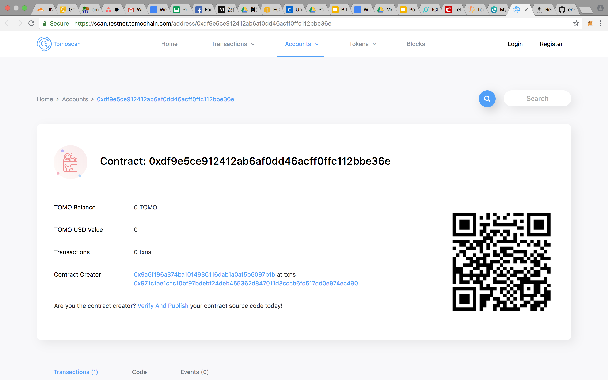
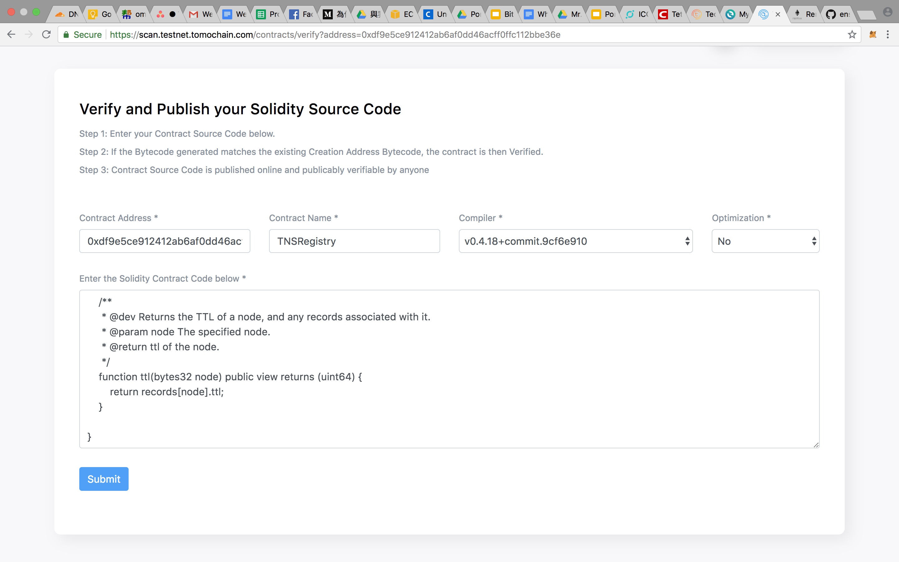
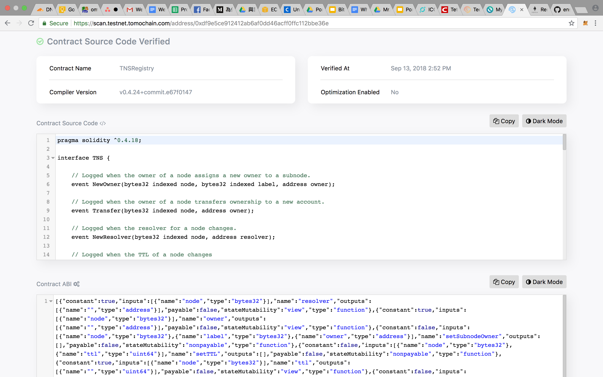
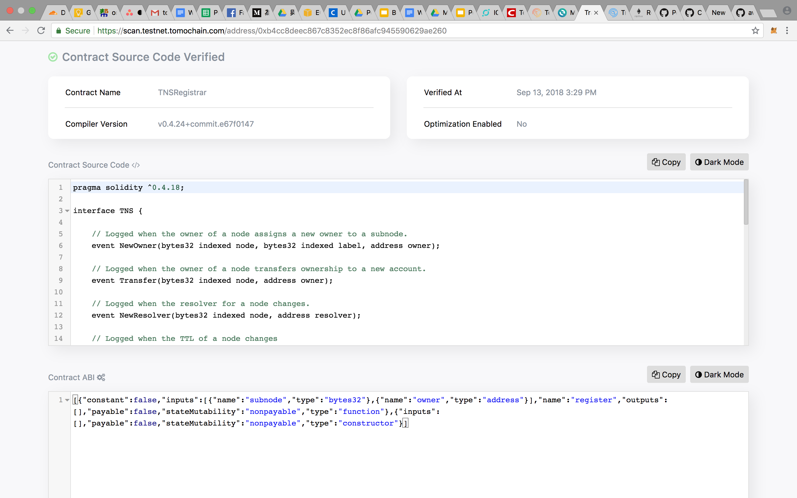
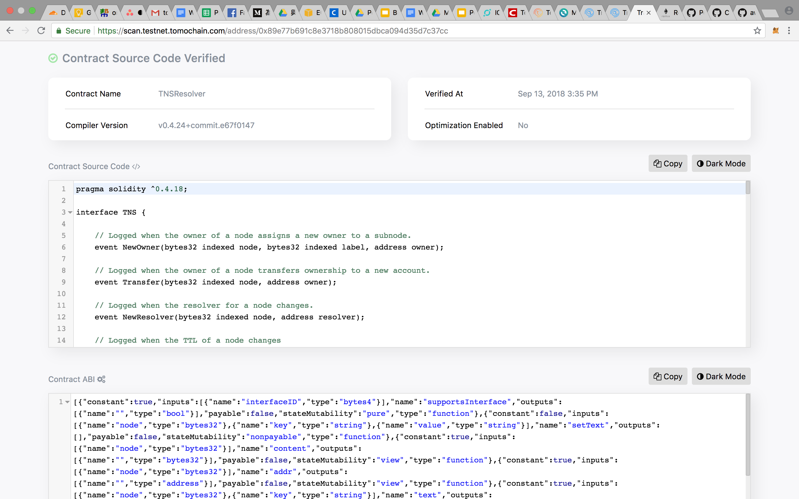

> 📖🔍 Documents of the TomoChain Name Service.

## 💡 What is TomoChain?
TomoChain is a public blockchain for dApps. The mission is to be a leading force in building the Internet of Value, designing its infrastructure and working to create an alternative financial system which is more secure, transparent, efficient, inclusive and equitable for everyone.

## 💡 What is BNS?
BNS – or blockchain name system – is the protocol on the internet that turns human-comprehensible decentralized website names such as ‘website.perl’ or ‘mywebsite.eth’ into addresses understandable by decentralized network machines.

## 📝 Description

TNS is the TomoChain Name Service, a distributed, open, and extensible naming system based on the TomoChain blockchain.

## 📚 Documents

#### Table of Contents
- [Introduction](./docs/INTRODUCTION.md)
- [Implementation](./docs/IMPLEMENTATION.md)
    - [Registry](./docs/REGISTRY.md)
    - [Registrar](./docs/REGISTRAR.md)
    - [Resolver](./docs/RESOLVER.md)
- [Integration](./docs/INTEGRATION.md)

## 📝 Guideline
- [Smart Contract Testing](./tns/README.md)
- [Smart Contract Design Principle](./docs/SMART_CONTRACT_DESIGN_PRINCIPLE.md)
- [Smart Contract Deploy](./docs/TUTORIAL.md)
- [TNS Deploy](./docs/Contract_deploy.md)

## Tech Stack


## ⚙️ TNS smart contract test coverage
__Continuous updating__
- [Coverage Report](./tns/coverage/)


```
Launched testrpc on port 8555
Running: truffle test
(this can take a few seconds)...
Using network 'development'.


  Contract: TNS
    ✓ should allow registration of names (103ms)
    ✓ should register a domain (125ms)
    ✓ should check resolver interfaces (99ms)
    ✓ should not support a random interface
    ✓ should set resolver for node (138ms)
    ✓ should set text (207ms)
    ✓ should set address (185ms)
    ✓ should set multihash (200ms)


  8 passing (3s)

-------------------|----------|----------|----------|----------|----------------|
File               |  % Stmts | % Branch |  % Funcs |  % Lines |Uncovered Lines |
-------------------|----------|----------|----------|----------|----------------|
 contracts/        |       75 |       50 |       76 |     77.5 |                |
  TNS.sol          |      100 |      100 |      100 |      100 |                |
  TNSRegistrar.sol |      100 |       50 |      100 |      100 |                |
  TNSRegistry.sol  |    78.57 |       50 |    77.78 |       80 |       68,69,96 |
  TNSResolver.sol  |    66.67 |       50 |    69.23 |    68.42 |... ,99,130,141 |
-------------------|----------|----------|----------|----------|----------------|
All files          |       75 |       50 |       76 |     77.5 |                |
-------------------|----------|----------|----------|----------|----------------|

Istanbul coverage reports generated
Cleaning up...
Shutting down testrpc-sc (pid 83549)
Done.
```

## TNS Deploy

### TNS Contracts

TNS Contract | Network    | Contract Address                           | Transaction Hash
-------------|------------|--------------------------------------------|-----------------------------------------------
Registry     | Testnet    | 0xdf9e5ce912412ab6af0dd46acff0ffc112bbe36e | [0x971c1ae1ccc10bf97bdebf24deb455362d847011d3cccb6fd517dd0e974ec490](https://scan.testnet.tomochain.com/txs/0x971c1ae1ccc10bf97bdebf24deb455362d847011d3cccb6fd517dd0e974ec490)
Registrar    | Testnet    | 0xb4cc8deec867c8352ec8f86afc945590629ae260 | [0xdf41eb54713ba8c931ef9c64a677b55759ee874606f3bb51e9b0f52434e68014](https://scan.testnet.tomochain.com/txs/0xdf41eb54713ba8c931ef9c64a677b55759ee874606f3bb51e9b0f52434e68014)
Resolver     | Testnet    | 0x89e77b691c8e3718b808015dbca094d35d7c37cc | [0xd66e858bbde4f95e30886c1d4d9dbaa76ea14d85628db4dcb50d087a8a86de22](https://scan.testnet.tomochain.com/txs/0xd66e858bbde4f95e30886c1d4d9dbaa76ea14d85628db4dcb50d087a8a86de22)

### Claim TOMO from faucet

Link: https://faucet.testnet.tomochain.com/


 
## Smart contract Deploy

### Source code compiler tool
- [Remix](http://remix.ethereum.org/)

### Publish and verify by Tomoscan

#### Step 1. Send transaction through myetherwallet
Paste the bytecode from Remix of the smart contract


#### Step 2. Check the transaction hash of smart contract


#### Step 3. Verify the smart contract


#### Step 4. View the verified smart contract
TNS Registry 

TNS Registrar

TNS Resolver


## 🗃 Changelog
See [CHANGELOG.md](./CHANGELOG.md).

## 📣 Contributing
See [CONTRIBUTING.md](./CONTRIBUTING.md) for how to help out.

## 🗒 Licence
See [LICENSE](./LICENSE) for details.
