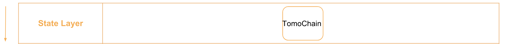
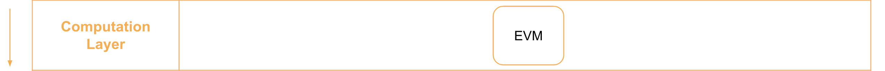
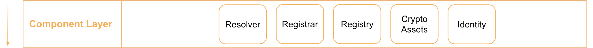
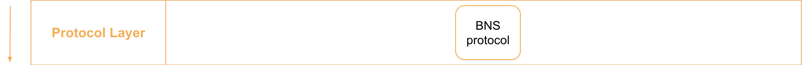
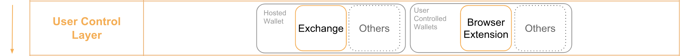
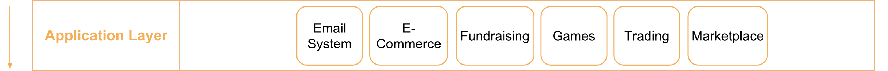

> 📖🔍 Documents of the TomoChain Name Service.

# Overview

## 💡 What is TomoChain?
TomoChain is a public blockchain for dApps. The mission is to be a leading force in building the Internet of Value, designing its infrastructure and working to create an alternative financial system which is more secure, transparent, efficient, inclusive and equitable for everyone.

## 💡 What is BNS?
BNS – or blockchain name system – is the protocol on the internet that turns human-comprehensible decentralized website names such as ‘website.perl’ or ‘mywebsite.eth’ into addresses understandable by decentralized network machines.

## 📝 Description

TNS is the TomoChain Name Service, a distributed, open, and extensible naming system based on the TomoChain blockchain.

## 📚 Documents

#### Table of Contents
- [Introduction](./docs/INTRODUCTION.md)
- [Implementation](./docs/IMPLEMENTATION.md)
    - [Registry](./docs/REGISTRY.md)
    - [Registrar](./docs/REGISTRAR.md)
    - [Resolver](./docs/RESOLVER.md)
- [Integration](./docs/INTEGRATION.md)

## 📝 Guideline
- [Smart Contract Testing](./tns/README.md)
- [Smart Contract Design Principle](./docs/SMART_CONTRACT_DESIGN_PRINCIPLE.md)
- [Smart Contract Deploy](./docs/TUTORIAL.md)
- [TNS Deploy](./docs/Contract_deploy.md)

## 🗂️ TomoChain Technical Stack
TomoChain Name Service (TNS) is governed by three smart contract components, registrar, registry, and resolver. The three smart contracts contain the core logic for the TomoChain Name Service implementation, from the ownership managment for a domain, to the global resolving layer that is reposible for connecting different tech stacks and enhances the usability for different infrastructures.


### State Layer
State layer is where user’s “state”, or user’s information and behavior, is stored. TomoChain is where these data are stored, and gives users the ability to control their own state.


### Computation Layer
TomoChain uses EVM (Ethereum Virtual Machine) in its computation layer, which is responsible for executing complicated calculations. It is in charge of managing, checking the code of smart contract on TomoChain. When a transaction occurs on TomoChain, the logic designed in EVM will determine its path that cannot be altered. Portal Network will be deploying TNS (Smart Contract Standard) on this layer that consists 3 major components.


### Component Layer
The design of digital assets can have more functions through combing the State Layer and Computation Layer, such as : crypto assets, and identities. Those programmable assets has many more potential usages and sub-economies within. TNS includes three major component:

A registry component stores all the information relative to a domain, and can operate the set of logics to map between the TomoChain domains and its owners.
A registrar component governs the domain purchase through the customized auction or trading rules.
A resolver component processes the corresponding resources from wallet address to decentralized application or website on TomoChain.


### Protocol Layer
On the Protocol Layer, we will be presenting our BNS (Blockchain Name Service) standards that can make the TNS more efficient and applicable. With the state, computation and component layers behind the scene, protocol layer serve as a gateway for users and developers to interact with our TNS standard.


### User Control Layer
User control layer is in charge of managing private keys to communicate with the state layer. TNS empowers users to control, set up and manage their digital asset with an easier and readable text, which could be further utilized in the next application layer.


### Application Layer
TNS can be implemented into many other applications on TomoChain, such as wallet that can resolve TNS, dApp that utilize TNS for users identity and many more. We believe that it is an essential components to provide a better environment for both technical and non-technical users.



## ⚙️ TNS smart contract test coverage
__Continuous updating__
- [Coverage Report](./tns/coverage/)


```
Launched testrpc on port 8555
Running: truffle test
(this can take a few seconds)...
Using network 'development'.


  Contract: TNS
    ✓ should allow registration of names (103ms)
    ✓ should register a domain (125ms)
    ✓ should check resolver interfaces (99ms)
    ✓ should not support a random interface
    ✓ should set resolver for node (138ms)
    ✓ should set text (207ms)
    ✓ should set address (185ms)
    ✓ should set multihash (200ms)


  8 passing (3s)

-------------------|----------|----------|----------|----------|----------------|
File               |  % Stmts | % Branch |  % Funcs |  % Lines |Uncovered Lines |
-------------------|----------|----------|----------|----------|----------------|
 contracts/        |       75 |       50 |       76 |     77.5 |                |
  TNS.sol          |      100 |      100 |      100 |      100 |                |
  TNSRegistrar.sol |      100 |       50 |      100 |      100 |                |
  TNSRegistry.sol  |    78.57 |       50 |    77.78 |       80 |       68,69,96 |
  TNSResolver.sol  |    66.67 |       50 |    69.23 |    68.42 |... ,99,130,141 |
-------------------|----------|----------|----------|----------|----------------|
All files          |       75 |       50 |       76 |     77.5 |                |
-------------------|----------|----------|----------|----------|----------------|

Istanbul coverage reports generated
Cleaning up...
Shutting down testrpc-sc (pid 83549)
Done.
```

## 🎯 TNS Deploy

### TNS Contracts

TNS Contract | Network    | Contract Address                           | Transaction Hash
-------------|------------|--------------------------------------------|-----------------------------------------------
Registry     | Testnet    | 0xdf9e5ce912412ab6af0dd46acff0ffc112bbe36e | [0x971c1ae1ccc10bf97bdebf24deb455362d847011d3cccb6fd517dd0e974ec490](https://scan.testnet.tomochain.com/txs/0x971c1ae1ccc10bf97bdebf24deb455362d847011d3cccb6fd517dd0e974ec490)
Registrar    | Testnet    | 0xb4cc8deec867c8352ec8f86afc945590629ae260 | [0xdf41eb54713ba8c931ef9c64a677b55759ee874606f3bb51e9b0f52434e68014](https://scan.testnet.tomochain.com/txs/0xdf41eb54713ba8c931ef9c64a677b55759ee874606f3bb51e9b0f52434e68014)
Resolver     | Testnet    | 0x89e77b691c8e3718b808015dbca094d35d7c37cc | [0xd66e858bbde4f95e30886c1d4d9dbaa76ea14d85628db4dcb50d087a8a86de22](https://scan.testnet.tomochain.com/txs/0xd66e858bbde4f95e30886c1d4d9dbaa76ea14d85628db4dcb50d087a8a86de22)

### Claim TOMO from faucet

Link: https://faucet.testnet.tomochain.com/


 
## Smart contract Deploy

### Source code compiler tool
- [Remix](http://remix.ethereum.org/)

### Publish and verify by Tomoscan

#### Step 1. Send transaction through myetherwallet
Paste the bytecode from Remix of the smart contract


#### Step 2. Check the transaction hash of smart contract


#### Step 3. Verify the smart contract


#### Step 4. View the verified smart contract
TNS Registry 

TNS Registrar

TNS Resolver


## 🗃 Changelog
See [CHANGELOG.md](./CHANGELOG.md).

## 📣 Contributing
See [CONTRIBUTING.md](./CONTRIBUTING.md) for how to help out.

## 🗒 Licence
See [LICENSE](./LICENSE) for details.
