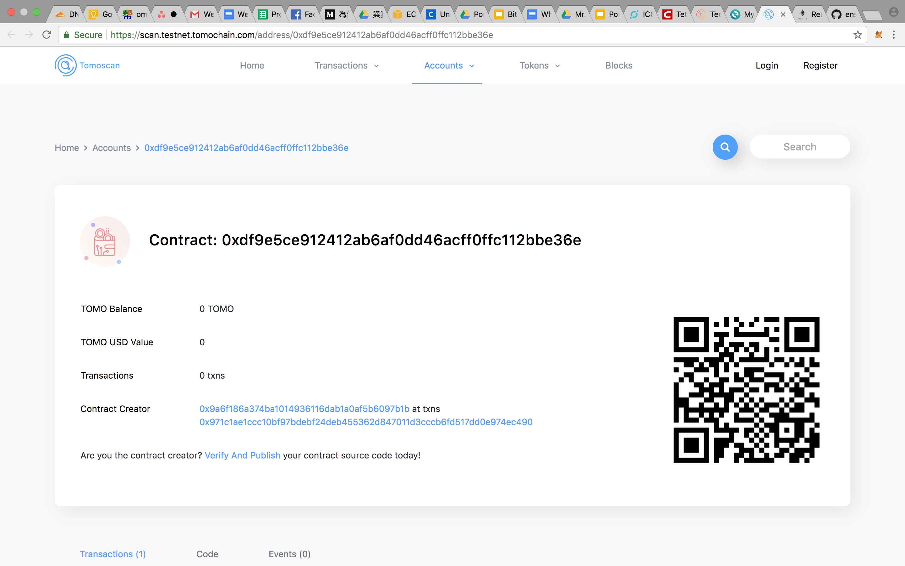
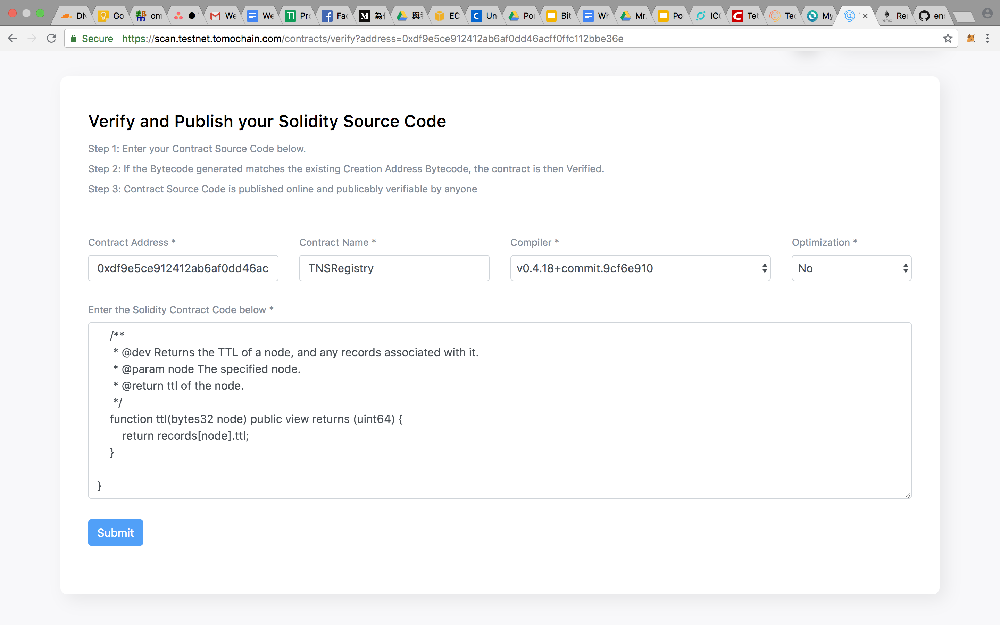
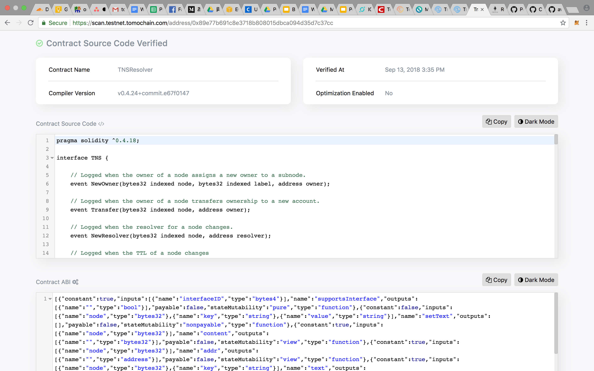

# Tutorial

## Claim TOMO from faucet

Link: https://faucet.testnet.tomochain.com/

Transaction Hash: https://scan.testnet.tomochain.com/txs/0x5097db117c7130abfc8abf611875279cc756d701d7d2799efc840c11dc1b6687

## Smart contract

### Source code compiler tool
- [Remix](http://remix.ethereum.org/)

### Publish and verify by Tomoscan

#### Step 1. Send transaction through myetherwallet
Paste the bytecode from Remix of the smart contract

#### Step 2. Check the transaction hash of smart contract

#### Step 3. Verify the smart contract

#### Step 4. View the verified smart contract

- TNSRegistry.sol, tx: https://scan.testnet.tomochain.com/address/0xdf9e5ce912412ab6af0dd46acff0ffc112bbe36e
- TNSRegistrar.sol, tx: https://scan.testnet.tomochain.com/address/0xb4cc8deec867c8352ec8f86afc945590629ae260
- TNSResolver.sol, tx: https://scan.testnet.tomochain.com/address/0x89e77b691c8e3718b808015dbca094d35d7c37cc
